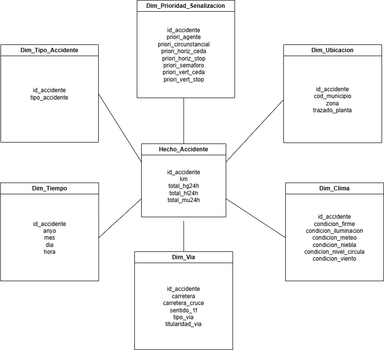
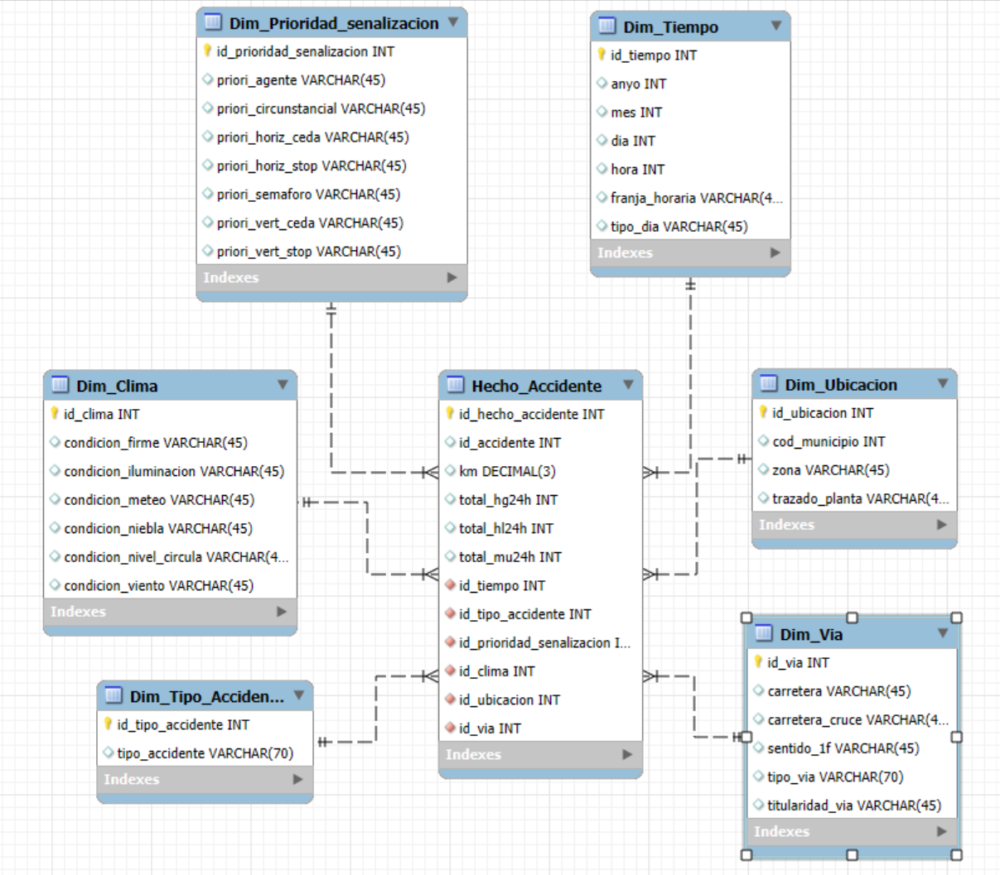

# 🚗 Análisis de Siniestralidad Vial en Alicante (2016-2024)

> **Pipeline ETL, Modelado Dimensional y Visualización Geoespacial**
> *Proyecto integral para la consolidación, limpieza, enriquecimiento y visualización de microdatos de accidentes de tráfico de la DGT.*

    

## 📋 Información del Proyecto

**Asignatura:** Adquisición y preparación de datos (UA)
**Autores:** Stanislav Gatin, Alejandro García, Guillermo García, Rodrigo Gavilán.

### Descripción General
Este repositorio contiene la solución completa para identificar patrones de letalidad en accidentes de tráfico. El proyecto procesa 9 años de microdatos de la DGT y se divide en dos fases principales:

1.  **Ingeniería de Datos (`pentaho/`):** Ingesta masiva, limpieza y transformación a un Modelo Dimensional (Esquema de Estrella) optimizado para BI.
2.  **Análisis y Visualización (`visualizaciones/`):** Enriquecimiento con fuentes externas (Wikidata, GVA), geocodificación y generación de dashboards interactivos.

---

## 🧩 Diseño del Almacén de Datos

Ubicación: Carpeta `/Diseños`

Este apartado recoge las diferentes fases de diseño del almacén de datos utilizadas en el proyecto, desde la abstracción inicial del problema hasta su implementación en el gestor de bases de datos. Estos diseños sirven como base para el desarrollo del proceso ETL y el posterior análisis de los datos.

### 📐 Diseño Conceptual
Define la estructura lógica del sistema desde un punto de vista abstracto, identificando la tabla de hechos y las dimensiones necesarias para el análisis de la siniestralidad vial. Este diseño permite comprender el dominio del problema y las relaciones entre los distintos elementos sin entrar en detalles técnicos.

- Diagrama conceptual del modelo dimensional:
  
  

- Archivo editable del diseño conceptual:
  
  [Diseño_conceptual](Diseños/Diseño_conceptual)

### 🧱 Diseño Lógico
Traduce el diseño conceptual a un esquema estructurado de tablas y relaciones, siguiendo un modelo dimensional en estrella. En esta fase se definen las claves primarias y foráneas que garantizan la integridad referencial y preparan el modelo para su implementación en un SGBD.

- Diagrama lógico del esquema estrella:
  
  

- Modelo editable en MySQL Workbench:
  
  [Diseño_Logico.mwb](Diseños/Diseño_Logico.mwb)

### 🗄️ Diseño Físico
Especifica la implementación final del modelo en MySQL, incluyendo tipos de datos, índices y restricciones. Este diseño es el que se utiliza directamente en la base de datos y está optimizado para consultas analíticas y procesos ETL.

Los diagramas correspondientes a cada fase pueden encontrarse en la carpeta `/Diseños`.

- Script SQL de creación de tablas y relaciones:
  
  [Diseño_Fisico.sql](Diseños/Diseño_Fisico.sql)

---

## 🏗️ Módulo 1: Ingeniería de Datos (ETL)
*Ubicación: Carpeta `/pentaho`*

Flujo de trabajo desarrollado en **Pentaho Data Integration (PDI/Kettle)**. Su objetivo es transformar archivos crudos y desnormalizados en datos limpios para el análisis de tendencias a largo plazo.

### Arquitectura del Flujo (Pipeline)

El proceso es orquestado por un Job maestro que controla tres componentes:

#### 1. 🤖 Orquestador (`Job.kjb`)
Controla el ciclo de vida de la ejecución:
* **START:** Inicio del cronograma.
* **TRANSFORMATION:** Ejecuta la lógica de negocio y limpieza.
* **SUCCESS:** Validación y notificación.

#### 2. 🔄 Flujo Principal (`Limpieza_Datos_DGT.ktr`)
Es el núcleo del ETL que realiza:
* **Extracción (Extract):** Uso de **Apache POI Streaming** para lectura eficiente de archivos pesados sin saturar la RAM.
* **Transformación (Transform):**
    * *Filter Early:* Restricción inmediata a la provincia de Alicante (`PROVINCIA = 3`).
    * *Binning:* Creación de categorías horarias (`Madrugada`, `Tarde`...) y tipos de día (`Laborable`/`Fin de Semana`).
    * *Lookups:* Decodificación de códigos numéricos usando diccionarios cargados en memoria (Cache).
* **Carga (Load):** Generación de archivos Excel independientes para dimensiones y tablas de hechos.

#### 3. 🗜️ Compresor (`csv_compressor.ktr`)
Unifica las salidas parciales en archivos maestros (`all_in_one`) para facilitar la carga final en las herramientas de visualización.

---

## 📈 Módulo 2: Análisis y Visualización
*Ubicación: Carpeta `/visualizaciones`*

Scripts en **Python** que toman los datos procesados, los enriquecen y generan visualizaciones avanzadas para la toma de decisiones.

### ⚙️ Scripts de Procesamiento
* **`geocodificar.py`**: Limpieza y georreferenciación. Filtra direcciones inválidas y utiliza la API de ArcGIS para validar coordenadas (score > 75).
* **`sankey.py`**: Procesa el grafo RDF y genera texto plano formateado para crear diagramas de flujo en [SankeyMATIC](https://sankeymatic.com/).
* **`map.py`**: Genera el mapa interactivo HTML cruzando puntos geocodificados con polígonos municipales y datos de Wikidata.

### 📊 Visualizaciones (Resultados)

#### 1. Mapa Híbrido (`mapa.html`)
Generado por `map.py`. Es una herramienta interactiva que permite:
* Explorar la densidad de accidentes por municipio (Coropletas).
* Localizar tramos concretos de alta siniestralidad ("puntos negros") mediante puntos exactos.
* Consultar datos demográficos enriquecidos al hacer clic en las zonas.

#### 2. Diagramas de Sankey (`.svg`)
Generados con los datos extraídos por `sankey.py`.
* **`flujo_completo.svg`:** Muestra la "historia" completa del accidente: *Vía $\to$ Tipo $\to$ Hora $\to$ Gravedad*.
* **`tipo_accidente-gravedad.svg`:** Relaciona la mecánica del impacto con la letalidad.
* **`tipo_via-gravedad.svg`:** Compara la siniestralidad en carreteras vs. zona urbana.

### 💾 Datos Fuente Auxiliares
* **`accidentes_cv_graph.ttl`**: Dataset transformado a Linked Data (RDF) con schema.org.
* **`municipios_cv.geojson`**: Perímetros municipales (Fuente: *Dades Obertes Generalitat Valenciana*).

---
